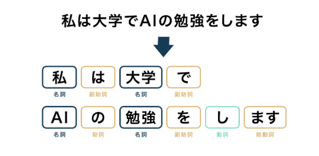

# PDFファイルからのテキスト抽出と統計解析
### 21RS001 青見俊
## 1.序論
　本章では、1.1節で研究背景、1.2節で研究目的、1.3節で研究方法について述べる。
### 1.1 研究背景
　理工学部情報科学科では複数の研究室が存在しており、3年次の学生は卒業研究のために研究室に配属され教員の指導を受け、4年次に卒業研究を行う。  
　研究室配属では、配属調査を3年次の前期に行ない、その調査結果を基に決定している。
### 1.2 研究目的
　本研究の目的は、卒業論文のPDFファイルをテキスト抽出し、形態素解析を行なうことである。これにより、研究室ごとの特色を明確にすることができ、3年次の研究室配属や4年次の卒業研究テーマ選択において、参考材料になると考える。
### 1.3 研究方法
　Pythonのライブラリを用いてPDFファイルからテキスト抽出を行い、同じくPythonで形態素解析を行い、統計解析をする。
## 2.テキスト抽出と形態素解析
　本章では、本研究で使用する技術の概要を述べる。まず、2.1節ではテキスト抽出の基本事項について説明する。次に2.2節ではPDFファイルからのテキスト抽出について説明する。最後に、2.3節では形態素解析について説明する。
### 2.1 テキスト抽出の基本事項[^1]
　テキスト抽出とは、主に組版加工済の印刷用データから、再利用を目的としてプレーンなテキストデータを抽出すること。DTPアプリケーションや文書作成ソフトによっては、指定形式でのデータ出力機能を利用することもできる。基本的には、抽出データに対して、形式調整やクリーニングなどの後処理が必要になる。以下に主なテキスト抽出の手法を説明する。
* **DTPデータからのテキスト抽出**  
　主要なDTPアプリケーションは、タグ付テキストやXHTMLなどの形式を指定してテキストデータを出力する機能を備えており、「テキスト書き出し」と呼ぶこともある。EPUB形式で直接、電子書籍を出力できるものも多い。ただし、そのDTPアプリケーションでの組版加工時において後のテキスト書き出しを想定してレイアウトなどに十分な配慮を行った場合を除き、期待通りの二次利用に適した形でのテキストデータ取得は難しい。  
　一括でのテキスト書き出しは、その後のチェックと調整を考慮すると現実的とは言えず、ここはページ単位またはページ内のテキストブロック単位でコツコツとテキストをコピー＆ペーストしていくのが、遠回りのように見えて、結局、一番効率が良い。コピー＆ペーストの単位で書籍レイアウトと比較確認しながら、チェックと必要な調整を施しておくことも重要である。

* **PDFファイルからのテキスト抽出**  
　PDFファイルからのテキスト取り出しについても、上記同様、コツコツとコピー＆ペーストするのが一番安全ではある。一方、PDFを対象にしたテキスト抽出ツールも無料・有料合わせて多数存在するので、組版レイアウトの複雑さやコンテンツのボリュームなども勘案し、適切なものを選ぶ必要がある。

　いずれの方法によるとしても、抽出・取得したテキストデータを原本と比較チェックし、調整を施すことは必須の作業である。
### 2.2 PDFファイルからのテキスト抽出[^2]
　現在PDFファイルからテキストを抽出する方法は多岐にわたる。本研究では、Pythonのライブラリを利用したPDFファイルからのテキスト抽出を行なう。そこでテキスト抽出の主なライブラリとその特徴についてまとめたものを記述する。  

　PythonでPDFファイルを操作するライブラリは主に`PyMuPDF`,`PyPDF2`,`PDFminer`などがある。それぞれのライブラリで得意とする操作が異なるため使い分けが重要である。各ライブラリの特徴を以下にまとめる。 
 
 **表1 ライブラリの特徴**
|操作|PyMuPDF|PyPDF2|PDFminer|
|:---:|:---:|:---:|:---:|
|テキスト抽出抽出|○|日本語非対応|○|
|ブックマーク抽出|○|-|○|
|画像抽出|○|○|JPEGのみ|
|複数ファイル結合|○|○||
|ページごとに分割|○|○||  

　本研究で使用する卒業論文が全ての日本語のため、`PyPDF2`では日本語に対応していないため文字化けしてしまうの本研究では向いていない。また、`PDFminer`ではコードが長くなってしまう。（`PyMuPDF` 6行：`PDFminer` 17行）これらの特徴から本研究ではPDFファイルからのテキスト抽出は`PyMuPDF`を使用するのが最適だと考える。
### 2.3 形態素解析[^3][^4]
　形態素解析（Morphological Analysis）は、自然言語処理の一環として、言語の単語に分割し、それぞれの単語の品詞や活用形などを判別する技術である。言語の文法や構造を理解するために、テキストデータを単語や形態素の単位に分解する役割を果す。形態素とは、言語学的な観点からは意味を持つ最小単位のことを指す。  

　例えば「私は大学でAIの勉強をします」という文章に対して形態素解析を行なうと以下のようになる。  
<div align="center">
  
</div>
<div align="center">
 <strong>図1　形態素解析の例</strong>
</div>  
<br>
　コンピュータ上で形態素解析を行なう場合、形態素解析エンジンと呼ばれるツールを用いて行なう。形態素解析を実行するためのツールはいくつか存在するが、なかでも代表的なのが`MeCab`,`JUMAN`,`JANOME`である。ここではそれぞれの特徴や違いを具体的に説明する。

* **MeCab**  
　MeCabとは、京都大学情報学研究科と日本電信電話株式会社コミュニケーション科学基礎研究所の共同研究のなかで、現Googleソフトウェアエンジニア 工藤拓氏によって開発されたオープンソース型の形態素解析ツールである。和布蕪（メカブ）と読む。開発者の好物であったのが名前の由来である。  
　辞書やコーパスの種類に依存せずに利用可能で、汎用的な設計となっていることが特徴である。そのため、C言語やC++、Java、Pythonといった数多くのプログラミング言語で利用可能かつ、様々な辞書も利用できるため、日本語の形態素解析で最も利用されている。「ChaSen」や「KAKASI」といった他の形態素解析ツールに比べて高速に動作する。ChaSenと比較すると、その速さは3〜4倍程度とされている。さらに、条件付き確率場とよばれる学習モデルにより高い解析精度を誇る。

* **JUMAN**  
　JUMANとは、京都大学の黒橋・河原研究室で開発された形態素解析ツールで、コンピュータによる日本語解析を行う研究者向けに提供されている。解析ツールそのものはホームページから無料でダウンロードが可能で、研究者以外でも利用は可能である。
　大きな特徴はWEBテキストから辞書情報を自動獲得できる点と、Wikipediaから抽出した辞書も利用できる点にある。また、文字コードUTF-8にも対応し、辞書情報はあらかじめ内包されているのもJUMANの特徴といえる。
  
* **JANOME**  
　Janomeとは Python の形態素解析エンジンであり、Python ライブラリをインストールする際に利用する`pip`と呼ばれるツールのみで簡単にインストールでき、依存ライブラリもない。そのため、手軽に形態素解析を行なうことができる。名前の由来は「蛇の目」から来ている。
## 3.統計解析
　本章では、まず、3.1節で統計解析について説明する。次に、3.2節でPythonのデータ分析を容易にする機能のライブラリ「**Pandas**」について説明する。
### 3.1 統計解析とは
　統計解析とは、大量のデータを収集・探索・分析し、その結果を提示することを通じて、データに含まれるパターンや傾向を明らかにする科学である。統計は調査研究、産業、行政など、さまざまな領域で日常的に利用されており、その目的は重要な意思決定についてより科学的な根拠を得ることである。コンピュータ上での統計解析は、計算能力の向上や統計解析ソフトウェアの発展により、より効率的かつ複雑な解析が可能となった。以下にコンピュータ上での統計解析に関連するポイントについて説明する。

* **統計ソフトウェア**  
　統計解析は通常、統計ソフトウェアを使用して行われる。代表的な統計ソフトウェアには、R、Python（主にNumPy、SciPy、pandas、Statsmodelsなどのライブラリを使用）、SAS、SPSS、Stataなどがある。これらのツールを使用することで、統計手法の実行や結果の可視化が容易になる。
* **データの前処理**  
　統計解析の前に、データを整理し、欠損値や外れ値の処理を行う必要がある。これには、データのクリーニングや変換が含まれる。コンピュータを利用することで、大規模なデータセットの処理が容易になる。
* **統計モデリング**  
　コンピュータ上での統計解析では、様々な統計モデルを構築し、データにフィットさせることができる。回帰分析、ANOVA（分散分析）、クラスタリング、因子分析など、さまざまな統計手法が利用される。
* **シミュレーション**  
　コンピュータ上で統計解析を行う際には、シミュレーションを利用して確率分布を評価したり、仮説検定を行ったりすることができる。これにより、複雑な問題に対する統計的なアプローチを採用できる。
* **ビッグデータ解析**  
　近年ではビッグデータが増加しており、コンピュータ上で大規模なデータセットを処理し、解析する能力が求められている。分散処理フレームワークやクラウドコンピューティングを使用して、大規模データに対応する統計解析が行われている。
### 3.2 Pandasとは
　本研究でも使用する**Pandas**とは、Pythonでのデータ分析を容易にするような機能のライブラリである。データ分析のツールとしてはとてもよく使われているものである。データ分析をする際には、手元にあるデータをまず整理するところから始まる。これを前処理と呼ぶこともあるがこのデータ整理で大きく効力を発揮する。**Pandas**は、NumPyを基盤にして2つのデータ型がある。1次元データのSeries（シリーズ）と2次元データのDataFrame（データフレーム）である。
## 4.設計書
　本章では、本研究の概要について詳しく述べる。まず、4.1節では本研究の開発環境と使用するPythonライブラリについて紹介する。次に、4.2節で研究の流れについて説明する。次に4.3節では進捗状況について説明する。最後に、4.4節では設計書に関する今後の展望について説明する。
### 4.1 開発環境
使用パソコン：九州産業大学貸与PC  

開発言語：**Python**  

使用する**Python**ライブラリ
* **Visual Studio Code**（実行環境のライブラリ）
* **PyMuPDF**（テキスト抽出のライブラリ）
* **MeCab**（形態素解析のライブラリ）
* **Pandas**（データ解析を容易にするライブラリ）
* **pip**（**Python**ライブラリをインストールするライブラリ）
### 4.2 研究の流れ  
　以下に研究の流れを順番に説明する。また、実際に使用したライブラリやソースコードがある場合はその都度説明する。  
 
#### ①データ収集
　各研究室の卒業論文のPDFファイルを収集し、フォルダにまとめる。PDFファイルは理工学部情報科学科学生用Webサーバから収集する。各研究室ごとにフォルダを作成し、PDFファイルをまとめる。ファイル名は[研究室名_元号]とする。例えば、令和4年度の成研究室の場合`sei_r04`となる。

#### ②PDFファイルからのテキスト抽出
　PDFファイルからのテキスト抽出を行なう。フォルダにあるすべてのファイルを読み込み、テキスト抽出を行なう。ここでページ数も表示する。ページ数は表紙、目次は含まないものとする。テキスト抽出は`PyMuPDF`ライブラリを使用する。サンプルプログラムでは1つのPDFファイルを読み込み、1ページずつテキストを抽出して出力するものだったため、このプログラムをベースに改良を加えた。複数のPDFファイルを読み込みテキスト抽出を行い、結果をテキストファイルに保存するコードに書き換えた。以下がサンプルプログラムと改良後のプログラムである。また、改良後のプログラムについて説明する。

* **サンプルコード**[^2]
```
# ライブラリ設定
import fitz

# PDFを読み込む
filename = '○○○.pdf'
doc = fitz.open(filename)
 
# １ページずつテキストを抽出して出力
for page in range(len(doc)):
    text = doc[page].get_text()
    print(text)
```
* **改良後のプログラムと実行結果**
```
# ライブラリ設定
import fitz
import os

def extract_text_from_pdf(pdf_path):
    # PDFファイルを開いてテキストを抽出
    doc = fitz.open(pdf_path)
    
    # 各ページのテキストを結合
    text = ''
    for page in range(len(doc)):
        text += doc[page].get_text()

    # ページ数も返す
    return text, len(doc)

def process_pdfs(input_folder, output_folder):
    # 出力フォルダが存在しない場合は作成
    if not os.path.exists(output_folder):
        os.makedirs(output_folder)

    # 入力フォルダ内のPDFファイルのパスを取得
    pdf_files = [file for file in os.listdir(input_folder) if file.endswith('.pdf')]

    if not pdf_files:
        print("指定されたフォルダにPDFファイルが見つかりませんでした。")
        return

    # 各PDFファイルを処理
    for pdf_file in pdf_files:
        pdf_path = os.path.join(input_folder, pdf_file)
        print(f"Processing PDF file: {pdf_path}")

        # テキストとページ数を抽出
        text, num_pages = extract_text_from_pdf(pdf_path)

        # 出力ファイルのパスを構築
        output_file = os.path.join(output_folder, f"{os.path.splitext(pdf_file)[0]}.txt")

        # テキストをファイルに保存
        with open(output_file, 'w', encoding='utf-8') as output:
            output.write(text)

        # ページ数を表示
        print(f"Number of pages in {pdf_file}: {num_pages}")

if __name__ == "__main__":
    # 読み込むフォルダのパスと出力フォルダのパスを指定
    input_folder = "/Users/User/project/sei_r04"
    output_folder = "/Users/User/project/sei_r04txt"
    
    # フォルダ内のPDFファイルを読み込み、テキストを抽出して保存
    process_pdfs(input_folder, output_folder)
```
|実行結果|
|:---|
|Processing PDF file: /Users/User/project/sei_r04\2023-18RS014.pdf
Number of pages in 2023-18RS014.pdf: 45
Processing PDF file: /Users/User/project/sei_r04\2023-19RS010.pdf
Number of pages in 2023-19RS010.pdf: 46
Processing PDF file: /Users/User/project/sei_r04\2023-19RS016.pdf
Number of pages in 2023-19RS016.pdf: 50
Processing PDF file: /Users/User/project/sei_r04\2023-19RS042.pdf
Number of pages in 2023-19RS042.pdf: 49
Processing PDF file: /Users/User/project/sei_r04\2023-19RS053.pdf
Number of pages in 2023-19RS053.pdf: 43
Processing PDF file: /Users/User/project/sei_r04\2023-19RS104.pdf
Number of pages in 2023-19RS104.pdf: 41
Processing PDF file: /Users/User/project/sei_r04\2023-19RS603.pdf
Number of pages in 2023-19RS603.pdf: 36|

　`extract_text_from_pdf(pdf_path)`関数は、指定されたPDFファイルからテキストを抽出するためのものである。`fitz`ライブラリを使用してPDFファイルを開き、各ページのテキストを結合して返す。  
　`process_pdfs(input_folder, output_folder)`関数は、指定された入力フォルダ内のPDFファイルを処理し、テキストを抽出して指定された出力フォルダに保存する。また、ページ数を表示する。  
　`if __name__ == "__main__":`ブロックは、スクリプトが直接実行されたときにのみ実行されるブロックです。読み込むフォルダと出力フォルダのパスを指定し、`process_pdfs`関数を呼び出してPDFファイルの処理を開始する。

　このプログラムの実行手順としては、`if __name__ == "__main__":`ブロックの中の読み込むフォルダのパスと出力フォルダのパスを指定し、実行するだけである。実行後、各PDFファイルのページ数が表示され、出力フォルダにテキストファイルが保存される。

#### ③形態素解析を行なう。[^5]
　抽出したテキストファイルから形態素解析を行なう。ライブラリはMeCabを使用する。品詞ごと抽出し、品詞ごとの頻出語をカウントする。前処理としてストップワードの削除も行なう。以下は前処理（ストップワードの削除）を含まない形態素解析のコードである。これは名詞のみを抽出し、頻出度が高い上位20単語実行結果として表示している。
* **MeCabによる形態素解析のコードと実行結果**
```
import collections
import MeCab
import glob
import os

def analyze_text_file(file_path, tagger):
    # ファイルの読み込み
    with open(file_path, 'r', encoding='UTF-8') as file:
        text = file.read()

    # 形態素解析を行う
    node = tagger.parseToNode(text)

    # 名詞を抽出
    word_list = []
    while node:
        word_type = node.feature.split(',')[0]
        if word_type in ["名詞"]:
            word_list.append(node.surface)
        node = node.next

    return word_list

def main():
    # MeCabの設定
    tagger = MeCab.Tagger()
    tagger.parse('')  # parseToNodeのバグ回避

    # フォルダ内のテキストファイルを取得
    folder_path = "/Users/User/project/sei_r04txt"
    text_files = glob.glob(os.path.join(folder_path, '*.txt'))

    if not text_files:
        print("指定されたフォルダにテキストファイルが見つかりませんでした。")
        return

    # 全てのテキストファイルを形態素解析して結果を結合
    all_word_list = []
    for text_file in text_files:
        print(f"Processing text file: {text_file}")
        word_list = analyze_text_file(text_file, tagger)
        all_word_list.extend(word_list)

    # 名詞の頻出語をカウント
    word_counter = collections.Counter(all_word_list)

    # よく使われている単語top20を出力
    print(word_counter.most_common(20))

if __name__ == "__main__":
    main()
```
|実行結果|
|:---|
|[('.', 23234), ('3', 654), ('2', 645), ('4', 625), ('1', 593), ('データ', 581), ('研究', 538), ('図', 528), ('-', 453), ('.........................', 424), ('_', 411), ('こと', 366), ('機能', 333), ('予約', 329), ('0', 324), ('(', 302), ('5', 295), ('[', 295), ('登録', 267), (')', 251)]|  

　実行結果を見て分かるとおり、ストップワード（不要語）の削除を行なわないと、「.」や「3」などの記号・数字が含まれてしまい、重要なデータを取得することができない。これでは次の統計解析に使えるデータではないので、いかに形態素解析の前処理が重要かがわかる。前処理に関しては今後追加していく予定である。また、形態素解析に関しても、何を抽出するかの仕様も今後決めていく。
#### ④形態素解析で得た情報をPandasに保存[^6]
　**Pnadas**には、ファイルを入出力する機能として、大きく4つの機能を提供している。

1. テキスト形式のデータファイルからデータの読み込み
2. バイナリ形式のデータファイルからデータの読み込み
3. データベースからのデータの読み込み
4. Web上からのデータの読み込み

　本研究では1のテキスト形式のデータファイルからの読み込みを行なう。ここで扱うデータはPDFファイルのページ数、形態素解析で得たデータとする。
#### ⑤Pandasのデータフレームをファイルに保存[^7]
　**Pandas**には、CSVファイルとして出力するメソッドとして、`DataFrame.to_csv()`メソッドが存在する。また、この際、区切り文字を CSVファイルで用いるカンマ (,) から タブ (\t) などへ置き換えることで、テキストファイルとして出力する事もできる。本研究ではデータをグラフ化するのでCSVファイル出力するのが適していると考える。
#### ⑥Pandasのデータファイルからグラフ化[^8]
　CSVファイルのグラフを作成する方法として、ここでは3つ説明する。
 
1. Pandasを用いてCSVファイルのグラフを作成
2. matplotlibとPandasでCSVファイルのグラフを作成
3. Excelを用いてCSVファイルのグラフを作成

　本研究ではまだどの方法を適用するか検討中である。
#### ⑦評価実験
　作成したグラフを基に評価実験を行なう。評価項目は以下の通りである。
　* 年度別でページ数、頻出単語で比較
　* 研究室別のページ数、頻出単語で比較
　* 研究室内の年度別のページ数、頻出単語で比較
#### ⑧考察
　実験結果を基に考察を行なう。
### 4.3 進捗状況
　進捗状況について説明する。①に関しては、使うデータの範囲が未決定である。全研究室の卒業論文の何年度の論文を対象とするかを決めなければならない。②に関しては、使用するライブラリの決定、動作確認も済んでいる。まだ少ないデータ数での動作なので、ファイル数が増えたときのテキスト抽出の自動化をすることが予想される。③に関しては、プログラムの動作確認は済んでいるため、どの品詞を抽出するかを検討する必要がある。また、前処理のストップワードの削除もまだ行なっていない。④～⑧に関しては、仕様の設計の段階で、まだ行なっていない。
### 4.4 今後の展望
　年度内に設計書の細かい部分を完璧に仕上げ、Pandasの実行環境を整えるところまで終わらせたい。4年次で卒業研究に取りかかる際に楽ができるような準備をしていきたい。
## 5 参考文献
[^1]:[JFPA 日本電子出版協会 テキスト切り出しとは？](https://www.jepa.or.jp/ebookpedia/201508_2546/)
[^2]:[PythonでPDFを読み込む（PyMuPDF,PyPDF2,PDFminer）](https://python-work.com/pdf-read/)
[^3]:[形態素解析とは？仕組みや主なツール、活用例など解説](https://www.sungrove.co.jp/morphological-analysis/)
[^4]:[形態素解析に代表される自然言語処理の仕組みやツールまとめ](https://www.cogent.co.jp/blog/morphological-analysis-natural-language-processing/)
[^5]:[pythonで形態素解析エンジンMeCabを使って名詞の出現回数を数える](https://python-man.club/python_morphological_analysis_noun/)
[^6]:[【初心者向け】データ分析で必須のPandasを入門しよう！](https://aiacademy.jp/media/?p=152)
[^7]:[PandasのデータフレームをCSVファイルやテキストファイルに出力する](https://pythondatascience.plavox.info/pandas/%E3%83%87%E3%83%BC%E3%82%BF%E3%83%95%E3%83%AC%E3%83%BC%E3%83%A0%E3%82%92%E5%87%BA%E5%8A%9B%E3%81%99%E3%82%8B)
[^8]:[【matplotlib】csvファイルからグラフを作成【pandas、csvモジュールと組合せ】](https://python-academia.com/matplotlib-csv/)
